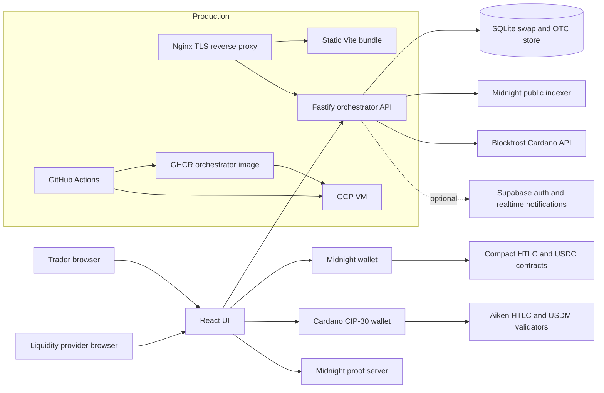

<p align="center">
  
</p>

<h1 align="center">Kaamos Midswap OTC</h1>

<p align="center">
  Private cross-chain OTC settlement between Cardano and Midnight using hash-time-locked escrow.
</p>

<p align="center">
  <a href="https://kaamos.fairway.global">Live preprod demo</a>
  &nbsp;|&nbsp;
  <a href="#quick-start-for-evaluators">Run locally</a>
  &nbsp;|&nbsp;
  <a href="#architecture">Architecture</a>
  &nbsp;|&nbsp;
  <a href="#settlement-flow">Settlement flow</a>
</p>

<p align="center">
  🔐 Atomic settlement &nbsp;·&nbsp; 🌉 No bridge custody &nbsp;·&nbsp; 🧾 RFQ workflow &nbsp;·&nbsp; ⚙️ Production-shaped deployment
</p>

<p align="center">
  
</p>

<p align="center">
  <sub>Live on preprod: USDM on Cardano ⇄ USDC on Midnight.</sub>
</p>

---

## What This Is

Kaamos Midswap OTC is a self-custodial cross-chain settlement prototype for institutional-style OTC trades. It lets two parties negotiate an RFQ, accept a quote, and settle the agreed trade across Cardano and Midnight without a custodian, bridge, or trusted escrow operator.

The current preprod implementation focuses on:

- ⚡ **Atomic settlement:** both sides complete, or both sides can reclaim after expiry.
- 🌉 **No bridge custody:** assets remain native to their source chain.
- 🔒 **Private bilateral execution:** Midnight handles the confidential side of the transaction flow.
- 🧭 **Operational UX:** RFQs, quotes, activity monitoring, reclaim screens, and wallet-based settlement.
- 🚀 **Production-shaped deployment:** static UI, containerized orchestrator, Nginx TLS, GHCR image publishing, and GitHub Actions deployment.

The demo trade pair is:

- 🟦 **USDM on Cardano preprod**
- 🌘 **USDC on Midnight preprod**

---

## Why It Matters

Cross-chain OTC settlement often falls back to manual coordination, custodial escrow, or bridge risk. Kaamos demonstrates a different path:

1. The parties agree off-chain through an RFQ and quote workflow.
2. Each side locks or deposits into native-chain HTLC contracts.
3. A shared SHA-256 hashlock binds both chains to the same secret.
4. Revealing the preimage to claim on one chain enables the counterparty to claim on the other.
5. Timelocks provide deterministic refund paths if the counterparty disappears.

The orchestrator improves UX and monitoring, but the settlement safety comes from the contracts and wallet-signed transactions.

---

## Repository Layout

```text
.
|-- htlc-ui/              React + Vite app, wallet flows, RFQ/order book UI
|-- htlc-orchestrator/    Fastify API, SQLite store, chain watchers, OTC backend
|-- contract/             Midnight Compact contracts and generated ZK assets
|-- cardano/              Aiken validators and compiled Cardano blueprint
|-- htlc-ft-cli/          Developer CLI for setup, minting, smoke flows, utilities
|-- deploy/               Docker Compose, Nginx, VM setup, production deploy scripts
`-- .github/workflows/    CI/CD for typecheck, UI build, Docker image, VM deploy
```

---

## Architecture



### Main Components

| Component | Path | Responsibility |
| --- | --- | --- |
| Web app | `htlc-ui/` | Landing page, wallet connection, RFQ/order book, swap execution, activity, reclaim, faucet |
| Orchestrator | `htlc-orchestrator/` | REST API, RFQ/quote state, swap index, SQLite persistence, chain watchers |
| Midnight contracts | `contract/src/htlc.compact`, `contract/src/usdc.compact` | Midnight HTLC escrow and preprod USDC contract |
| Cardano validators | `cardano/validators/` | Cardano HTLC and USDM validator logic |
| CLI tooling | `htlc-ft-cli/` | Contract setup, minting, balance checks, smoke-test flows |
| Deployment | `deploy/`, `.github/workflows/deploy.yml` | Nginx, Docker Compose, GCP VM setup, CI/CD deployment |

---

## Settlement Flow

Kaamos supports both trade directions through the same HTLC pattern.

### OTC RFQ Flow

1. **Originator creates an RFQ** with a side, sell amount, indicative buy amount, and expiry.
2. **Liquidity providers submit quotes** against the RFQ.
3. **Originator accepts a quote**, freezing the negotiated terms and counterparty wallet snapshot.
4. **Settlement starts** from the accepted RFQ and bridges into the atomic swap flow.
5. **Activity and notifications** track RFQ, quote, and settlement lifecycle events.

### Atomic Swap Flow

1. **Maker commits first.** The initiating party locks or deposits on the first chain.
2. **Taker commits second.** The counterparty locks or deposits on the other chain using the same hash.
3. **Claim reveals the preimage.** The first successful claim publishes the secret.
4. **Counterparty claims with the same preimage.** This completes both sides of the swap.
5. **Refunds are available after expiry.** If the flow stalls, each side can reclaim from its own chain after the timelock.

### Safety Model

- **Hashlock:** funds can only be claimed with the correct SHA-256 preimage.
- **Timelock:** funds can be reclaimed after deadline if settlement does not complete.
- **Native execution:** Cardano and Midnight assets settle on their own chains.
- **Orchestrator is not custody:** it stores metadata, RFQs, and observed chain state; it does not hold funds or private keys.

---

## Quick Start For Evaluators

The fastest way to evaluate the complete deployed experience is the preprod demo:

```text
https://kaamos.fairway.global
```

To run the code locally, use Node 24 and install from the repo root. This repository is an npm workspace, so dependency installation must happen at the root.

### Prerequisites

- Node.js `24.11.1` or newer
- npm
- A Cardano preprod API key from Blockfrost for full Cardano flows
- A Midnight proof server for real Midnight contract interactions
- Wallet extensions for full swap execution:
  - Midnight wallet
  - Cardano CIP-30 wallet such as Eternl, Lace, Nami, or Flint

For UI review only, you can run the app without wallets. For real preprod settlement, wallets, test funds, Blockfrost, and proof server access are required.

### 1. Install Dependencies

```bash
nvm use
npm ci
```

### 2. Configure The Orchestrator

```bash
cp htlc-orchestrator/.env.example htlc-orchestrator/.env
```

Edit `htlc-orchestrator/.env`:

```bash
PORT=4000
HOST=0.0.0.0
DB_PATH=./swaps.db
LOG_LEVEL=info

MIDNIGHT_NETWORK=preprod
BLOCKFROST_API_KEY=your_blockfrost_preprod_key

# Optional for local auth/RFQ user accounts.
SUPABASE_URL=
SUPABASE_SERVICE_ROLE_KEY=

# Optional. Localhost is already allowed by default.
CORS_ORIGINS=
```

If `BLOCKFROST_API_KEY` is empty, the Cardano watcher is disabled. The API and UI can still start, but Cardano-side automatic status detection will not run.

### 3. Configure The UI

`htlc-ui/.env.preprod` is the local Vite environment file used by `npm run dev` and `npm run build`.

For local evaluation, the important values are:

```bash
VITE_NETWORK_ID=preprod
VITE_LOGGING_LEVEL=trace
VITE_PROOF_SERVER_URI=http://127.0.0.1:6300
VITE_BLOCKFROST_API_KEY=your_blockfrost_preprod_key
VITE_ORCHESTRATOR_URL=http://localhost:4000
```

The proof server is required only when executing Midnight transactions. General UI review and backend health checks do not need it.

### 4. Start The Backend

In terminal 1:

```bash
cd htlc-orchestrator
npm run dev
```

Verify it:

```bash
curl http://localhost:4000/health
```

Expected response:

```json
{"ok":true,"db":"./swaps.db"}
```

### 5. Start The UI

In terminal 2:

```bash
cd htlc-ui
npm run dev
```

Open:

```text
http://localhost:5173
```

The UI predev hook copies the current ZK assets and Cardano blueprint into `htlc-ui/public/` before Vite starts.

---

## Local Evaluation Checklist

For a quick judging pass:

1. Open `/` and inspect the product landing page.
2. Open `/app` and verify the wallet-driven swap surface loads.
3. Open `/browse` to view open swaps indexed by the orchestrator.
4. Open `/activity` to inspect swap and RFQ lifecycle state.
5. Open `/reclaim` to inspect refund/recovery UX.
6. Open `/faucet` to mint preprod demo tokens after connecting wallets.
7. If Supabase is configured, open `/orderbook` to test authenticated RFQ and quote workflows.

Useful local endpoints:

```bash
curl http://localhost:4000/health
curl http://localhost:4000/api/swaps
curl http://localhost:4000/api/rfqs
```

---

## Build And Verification

### Typecheck Orchestrator

```bash
cd htlc-orchestrator
npm run typecheck
```

### Build UI

```bash
cd htlc-ui
npm run build
```

### Preview Built UI

```bash
cd htlc-ui
npm run start
```

Open:

```text
http://localhost:8080
```

### Recompile Midnight Contracts

Only needed if you change `contract/src/*.compact`.

```bash
cd contract
npm run compact:htlc
npm run compact:usdc
npm run build:all
```

After recompiling contracts, rebuild or restart the UI so fresh ZK assets are copied into `htlc-ui/public/`.

---

## API Surface

The orchestrator exposes a small REST API. Key routes:

| Route | Purpose |
| --- | --- |
| `GET /health` | Runtime health check |
| `GET /api/swaps` | List indexed swaps, optionally filtered by status or direction |
| `POST /api/swaps` | Register a newly created swap |
| `GET /api/swaps/:hash` | Fetch one swap by 32-byte hash |
| `PATCH /api/swaps/:hash` | Record deposits, claims, reclaims, preimage, or status |
| `GET /api/rfqs` | List RFQs |
| `POST /api/rfqs` | Create an authenticated RFQ |
| `GET /api/rfqs/:id` | Fetch RFQ detail |
| `POST /api/quotes` | Submit or counter quotes |
| `GET /api/activity` | Read OTC activity feed |
| `POST /api/auth/*` | Supabase-backed auth and user flows |

Supabase is optional. When it is not configured, the unauthenticated swap API still runs, while authenticated OTC routes return service-unavailable responses.

---

## Production Deployment

Production is intentionally simple:

- GitHub Actions runs typecheck.
- GitHub Actions builds the orchestrator Docker image and pushes it to GHCR.
- GitHub Actions builds the static Vite UI bundle.
- The UI bundle is copied to the GCP VM at `/var/www/midswap`.
- `deploy/docker-compose.yml` runs the orchestrator container on `127.0.0.1:4000`.
- Nginx serves the UI and reverse-proxies `/api/*` and `/health` to the orchestrator.
- TLS is terminated by Nginx with Let's Encrypt certificates.

Current live domain:

```text
https://kaamos.fairway.global
```

Important production files:

| File | Purpose |
| --- | --- |
| `.github/workflows/deploy.yml` | CI/CD workflow |
| `htlc-orchestrator/Dockerfile` | Reproducible orchestrator image |
| `deploy/docker-compose.yml` | Runtime container definition |
| `deploy/nginx/midswap.conf` | Static UI and reverse proxy config |
| `deploy/scripts/setup-vm.sh` | One-time VM bootstrap |
| `deploy/scripts/deploy.sh` | Per-release deployment script |
| `deploy/.env.example` | Host-side production environment template |

Required GitHub Actions secrets:

```text
VM_IP
VM_USER
VM_SSH_KEY
DOMAIN_NAME
VITE_PROOF_SERVER_URI
VITE_BLOCKFROST_API_KEY
```

The VM also needs `/opt/midswap/.env`, based on `deploy/.env.example`, with server-side values such as `BLOCKFROST_API_KEY`, `HTLC_CONTRACT_ADDRESS`, `MIDNIGHT_NETWORK`, and `CORS_ORIGINS`.

---

## Troubleshooting

### `npm ci` fails inside a workspace

Run it from the repository root:

```bash
npm ci
```

This repo uses a single root `package-lock.json` for all workspaces.

### UI says the orchestrator is unreachable

Start the backend:

```bash
cd htlc-orchestrator
npm run dev
```

Then verify:

```bash
curl http://localhost:4000/health
```

Also confirm:

```bash
VITE_ORCHESTRATOR_URL=http://localhost:4000
```

### Cardano status does not update automatically

Set `BLOCKFROST_API_KEY` in `htlc-orchestrator/.env` and restart the orchestrator.

### Midnight transactions fail locally

Confirm a proof server is running and matches:

```bash
VITE_PROOF_SERVER_URI=http://127.0.0.1:6300
```

### Auth or RFQ creation returns 503

Configure Supabase in both environments:

- Server side: `SUPABASE_URL`, `SUPABASE_SERVICE_ROLE_KEY`
- Client side: `VITE_SUPABASE_URL`, `VITE_SUPABASE_ANON_KEY`

The legacy swap flow remains available without Supabase.

---

## Project Status

This is a preprod hackathon build. It is designed to demonstrate the end-to-end mechanics of cross-chain OTC settlement, not to handle mainnet value without further audit, hardened monitoring, and production key management.

What is already in place:

- Wallet-driven Cardano and Midnight flows
- Compact and Aiken HTLC contracts
- RFQ, quotes, activity, and reclaim UX
- Server-side chain watchers
- SQLite persistence
- Optional Supabase auth and notifications
- Dockerized orchestrator
- Nginx TLS deployment on GCP
- GitHub Actions build and deploy pipeline

Before any mainnet launch:

- Complete independent contract review.
- Harden proof-server and wallet compatibility assumptions.
- Add production-grade observability and alerting.
- Move demo faucet behavior behind strict controls.
- Review rate limits and provider redundancy for Blockfrost and Midnight indexer dependencies.

---

## License

MIT. See `LICENSE`.
